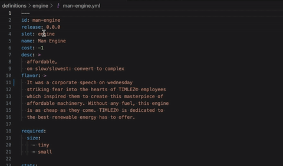

# Steelpinion VSCode Mod Helper
[Steelpinion][steelpinion] is a turnbased multiplayer steampunk tactical combat simulator.  
It supports modding equipable items on ships, personnel, and more.  
This extension includes very useful context help for mod files found in https://github.com/steel-pinion/mods _(the mod repo isn't public yet, but will be set to public eventually)_.



## Features
While not a full blown language server with autocomplete and full type signatures,
we are still enhancing the mod file code blocks with typescript syntax highlighting.

The game was originally written in javascript, then later converted to typescript;
because of this history, we take advantage of certain naming conventions to predict
types using an annotated json schema _(exported from typescript definitions)_.

## Requirements
_Presently, this is only for internal engineers or modders on the project._

----------
# Guidance
_This section will include some of the typescript definitions as-is from the game engine. There will also be a table which explains each standard rule's suggested keywords to use for tooltip guidance._

Since modders are required to declare a `before/after` clause for each `IUserInjectedMod` (aka `ability.on`), each `event` and `subject` can be a slightly different child entity type. `event` will always at least be an `IEvent`, but it is nice to know when working with specifically `IDeployEntityEvent`, `IMoveEntityEvent`, `ICollideEntityEvent`, `ISalvoEvent`, etc. 

Similarly for `subject`; each `subject` is always an `IEntityState`, but could more specifically be `IShipState`, `IObstacleState`, `IAuxOrdnanceState`, or `IPersonState`.

A `IUserInjectedMod` may look like this in the mod files:
```js
...
ability:
  on:
    - after: executes a maneuver
      when: iRandom.chance(0.50);
      then: |
        let moveEvent = event
        let ship = subject

        let oneSizeLess = {
          'tiny': 'tiny',
          'small': 'tiny',
          'medium': 'small',
        }[ship.size]

        addEvent(EVENT_NAME.DEPLOY_OBSTACLE, {
          defId: `dense-smog-${oneSizeLess}`,
          position: event.lastPosition,
          rotation: event.rotation
        });
...
```

**tip 1:** Take special note of the `let moveEvent = event` and `let ship = subject` which are how you can get the javascript snippet to offer some hover tooltips for specific keywords.

**tip 2:** Syntax highlighting will act wacky if you are missing EXACTLY ONE semicolon `;`. Yes only one at the very end of the code block to signal we are done with our javascript block. So for each `when`, `then` statements, you will have one semicolon each. **Do not put a semicolon at the end of each line** or else the embedded syntax highlighting in yaml will start to fail and act wacky.


## Standard Rules for engine v5.1.0


| after/before Rule Name | event keyword | subject keyword | event type | subject type |
|:-|:-|:-|:-|:-|
pinion is taking flight|deployEvent|ship|IDeployEntityEvent|IShipState
pinion has compliment|deployEvent|ship|IDeployEntityEvent|IShipState
launched aux ordnance|deployEvent|aux|IDeployEntityEvent|IAuxOrdnanceState
produced an obstacle|deployEvent|obstacle|IDeployEntityEvent|IObstacleState
it is raining|tapEvent|subject|TTapEvent|IMacroEntityState
executes a maneuver|moveEvent|ship|IMoveEntityEvent|IShipState
cannot execute maneuver when being tugged|moveEvent|subject|IMoveEntityEvent|IMacroEntityState
changed facing direction|moveEvent|ship|IMoveEntityEvent|IShipState
cannot be rotated freely|moveEvent|subject|IMoveEntityEvent|IMacroEntityState
shifts to|moveEvent|obstacle|IMoveEntityEvent|IObstacleState
spins around|moveEvent|obstacle|IMoveEntityEvent|IObstacleState
yanked on deck|moveEvent|ship|IMoveEntityEvent|IShipState
vessel risks crash|collisionEvent|subject|ICollideEntityEvent|IMacroEntityState
boarding party raids|collisionEvent|subject|ICollideEntityEvent|IMacroEntityState
hidden by vapor|collisionEvent|subject|ICollideEntityEvent|IMacroEntityState
loosed blind round|ballisticEvent|subject|IBallisticEvent|IMacroEntityState
blind round trajectory|ballisticEvent|subject|IBallisticEvent|IMacroEntityState
blind round collateral trajectory|ballisticEvent|subject|IBallisticEvent|IMacroEntityState
loosed piercing round|laserEvent|subject|ILaserEvent|IMacroEntityState
evaded piercing round|laserEvent|subject|ILaserEvent|IMacroEntityState
piercing round trajectory|laserEvent|subject|ILaserEvent|IMacroEntityState
spreads ordnance|fanEvent|subject|IFanstackEvent|IMacroEntityState
misspreads ordnance|fanEvent|subject|IFanstackEvent|IMacroEntityState
blasts ordnance|aoeEvent|subject|IAoeEvent|IMacroEntityState
misblasts ordnance|aoeEvent|subject|IAoeEvent|IMacroEntityState
pinion salvos|salvoEvent|subject|ISalvoEvent|IMacroEntityState
pinion missed|salvoEvent|subject|ISalvoEvent|IMacroEntityState
pinion grazed|salvoEvent|subject|ISalvoEvent|IMacroEntityState
pinion evaded|salvoEvent|subject|ISalvoEvent|IMacroEntityState
armor blocked crash|collisionEvent|subject|ICollideEntityEvent|IMacroEntityState
hull smashed by|collisionEvent|subject|ICollideEntityEvent|IMacroEntityState
armor broken to block|salvoEvent|subject|ISalvoEvent|IMacroEntityState
hull is devastated|salvoEvent|subject|ISalvoEvent|IMacroEntityState
hull is hit|salvoEvent|subject|ISalvoEvent|IMacroEntityState
structure is hit|tapEvent|subject|TTapEvent|IMacroEntityState
materials reduce effect|tapEvent| |TTapEvent|IEntityState
materials amplify effect|tapEvent| |TTapEvent|IEntityState
frost and fire negate|tapEvent| |TTapEvent|IEntityState
intense shock disables|tapEvent| |TTapEvent|IEntityState
intense flame consumes|tapEvent| |TTapEvent|IEntityState
captain is pressured|tapEvent|subject|TTapEvent|IMacroEntityState
in a groove|salvoEvent|subject|ISalvoEvent|IMacroEntityState
slowly destealth|tapEvent|subject|TTapEvent|IMacroEntityState
flame burns| | |IEvent|IEntityState
frost bites| | |IEvent|IEntityState
debuff fixed|tapEvent| |TTapEvent|IEntityState
morphing into|tapEvent|subject|TTapEvent|IMacroEntityState
has new affix|tapEvent|subject|TTapEvent|IMacroEntityState
nerfed|tapEvent| |TTapEvent|IEntityState
structure is destroyed|tapEvent|subject|TTapEvent|IMacroEntityState
pinion is sunk|tapEvent|subject|TTapEvent|IMacroEntityState
daydreaming|tapEvent| |TTapEvent|IEntityState
exerts effort| | |IEvent|IEntityState
braces self| | |IEvent|IEntityState
treks| | |IEvent|IEntityState
knockbacked| | |IEvent|IEntityState
nearly controls| | |IEvent|IEntityState
snatches control| | |IEvent|IEntityState
subverts ordnance| | |IEvent|IEntityState
intends to harm| | |IEvent|IEntityState
resists harm| | |IEvent|IEntityState
is harmed| | |IEvent|IEntityState
ko'd|tapEvent| |TTapEvent|IEntityState
hyperventilates| | |IEvent|IEntityState


---------------------
## Engine Typescript for v5.1.0
_note: this is not all of the typescript, just those annotated with a `@modKeyword`_

```typescript
/**
 * @modKeyword ability
 * Various actions that are extended to the parent entity.
 * Usually attached to a ship, and grants that ship extra actions.
 * Informs the behaviours within solvers.
*/
interface IAbilityDef {
  create?: ICreateAbility
  assault?: IAssaultAbility
  on?: IUserInjectedMod | IUserInjectedMod[]
}

/**
 * @modKeyword addEffect
 * Each effect may have varying parameters,
 * but most typically honor `intensity`
 * consistently as a number value signifying "more"
 * of the effect in queston.
 * 
 * A guide will likely need to be published for the baseline 
 * effects and events so that modders are aware of the various
 * ways they are used.
*/
interface IAddEffectParams {
  to: IEntityState
  effectName: TEffectName
  effect: Partial<IEffectState>
}

/**
 * @modKeyword aoeEvent
 * An aoe event has two collision checks which determine if
 * anyone in the blast is susceptible to more damage via `isHotshot`
 * flag. The inner ring of the blast can optionally do more things.
*/
interface IAoeEvent extends IEvent { 
  hitId: string
  ordnanceId: TDefId
  attacker: IMacroEntityState
  intensity: number
  isHotshot: boolean
  distance: number
  damageType: TDamageType

/**
 * @modKeyword missEvent
 * An explosion wouldn't exactly "miss" explicitly
 * in a pure physics engine. Since we have a notion of
 * `evasion` via `speed` dice rolls, we therefore also
 * have to register a collision with the explosion, yet
 * flagged as safe.
*/
interface IAoeMissEvent extends IEvent {
  ordnanceId: TDefId
  defender: null
}

/**
 * @modKeyword assault
 * Alters specific physics solver algorithm
 * for an attack action.
*/
interface IAssaultAbility {
  solver: TSolverAlgorithmName
  power: number
  ammo: number
  range: {
    min: number
    max: number
  }
}

/**
 * @modKeyword ballisticEvent
 * Is effectively the same as `ILaserEvent`,
 * but is designed to NOT pierce through.
 * It will only hit one target after all evades
 * ricochet, skilled shots are calculated.
*/
interface IBallisticEvent extends IEvent {
  hitId: string
  ordnanceId: TDefId
  distance: number
  damageType: TDamageType
  attacker: IMacroEntityState
  defender: IMacroEntityState
  stacks: TAngleMask[]
  evades: TDiceDigit[]
  collateral: IBallisticCollateralHit[]
  hitAngleMask: TAngleMask
  attackAngleMask: TAngleMask
}

/**
 * @modKeyword collisionEvent
 * Units that try to occupy the same phyical space produce this event.
 * intensity is a general calculation of how hard the impact is.
 * Intensity isn't well defined unit, but generally can be trusted that the ship hit
 * something at a certain speed and of a certain mass.
 * Smaller ships are at a disadvantage during collisions since they have less mass
 * and are more likely to encounter higher intensities.
*/
interface ICollideEntityEvent extends IEvent { 
  with: TEntityId
  atWaypoint: number
  angleMask: TAngleMask
  intensity: number
  moveSpeed: TSpeed
}

/**
 * @modKeyword create
 * Describes how an auxOrdnance will bahave after it is spawned.
*/
interface ICreateAbility {
  angle: TAngleMask
  fuel: number
  trajectory: TManeuverName
}

/**
 * @modKeyword deployEvent
 * This is a unit spawn or instantiation.
 * The map is 2d on the server.
*/
interface IDeployEntityEvent extends IEvent {
  position: TVector3
  rotation: TEulerRotation
}

/**
 * @modKeyword effect
 * These are not super well defined yet,
 * and are meant to be a flexible shared parameter space.
 * The parameters are used by a rule 
 * and can have different meanings depending on the implementation.
 */
interface IEffectState {
  id?: string
  eventId: number
  intensity: number
  cause?: string
  decision: TDecisionIndex
  decisionExpiration: TDecisionIndex
  [concept: string]: string | number | undefined
}

/**
 * @modKeyword consts
 * Isolated modable keys which make sense to mod.
 * Comes from {@link IModConstants},
 * but can these can be extended as well to have new keys.
 */
interface IEntityConstants {
  DAMAGE: IModDamageConsts
  DICE: IModDiceConsts
  RARE_CRIT: IModRareCritConsts
  [category: string]: Partial<IModFile>
}

/**
 * @modKeyword subject
 * Base class for all game objects with state tracking needs.
 * It was imagined that there would be
 * ships, projectiles, obstacles, and people that need be managed.
 * Ideally all of those entities would have reactions
 * to the same effects, even if they reacted differently.
 * This base entity is meant to encapsulate
 * the most common functionality shared between all entities.
 */
interface IEntityState {
  def: IEntityDef
  defId: TDefId
  entityId: TEntityId
  type: TEntityTypeName
  slot: TSlotName
  index: number
  owner: TOwnerId
  size: TSizeName
  dimensions: TVector2
  intent: TIntentName
  position: TVector3
  rotation: TEulerRotation
  stats: IBaseStats
  affix: TAffix[]
  report: IPreviousMutationReport
  consts: IEntityConstants
  isTouchingPoint: (point: TVector2) => boolean
  hasTrait: (trait: TTraitName, specificValue?: string) => boolean
  getTrait: (trait: TTraitName) => string
  hasEffect: (effectName: TEffectName, truthyPropertyName?: string) => boolean
  hasEffects: (effect: TEffectName, filterBy: TEffectFilter) => boolean
  getEffects: (effectName: TEffectName, filterBy?: TEffectFilter, limit?: number) => IEffectState[]
  setDefinition: (def: IEntityDef) => void
  setIntent: (intent?: TIntentName) => void
  setPosition: (newPos: TVector3) => void
  setRotation: (newRot: TEulerRotation) => void
  setReportEntry: <T>(name: string, value: T) => void
  mutateStats: <T>(statName: TNumericStatName, modifyBy: number) => T
  addPendingEffect: (effectName: TEffectName, effectSettings) => number
  nextPendingEffect: (effectName, removalCheck: TEffectFilter) => IEffectState | undefined
  popPendingEffects: (effectName: TEffectName, filterBy?: TEffectFilter, limit?: number) => IEffectState[]
  removePendingEffect: (effectName: TEffectName, filter: TEffectFilter, limit?: number) => number
  alterPendingEffect: (effectName: TEffectName, mapFunc: TEffectStateAlteration, filter?: TEffectFilter, limit?: number) => number
  effectIntensity: (effectName: TEffectName, filterBy?: TEffectFilter) => number
  resolve: <T>() => T
}

/**
 * @modKeyword event
 * This is the baseline building block used to create visible effects,
 * moving the progression of the battle forward.
 * There are several kinds of events depending on the solver,
 * and those events are passed through any number of rules
 * which finally create effects.
 * 
 * A diagram and article was created to better illustrate how this happens.
 * https://steelpinion.com/steel-saturday/article-10
*/
interface IEvent {
  eventId: TEventId
  entityId: TEntityId
  type: TEventName
  touchCount?: number
  [eventProp: string]: unknown
}

/**
 * @modKeyword required
 * A list of traits with corresponding acceptable values for those traits which allow this component to be attached legally.
*/
interface IExpectOneOfCollection {
  [traitName: TTraitName]: string[]
}

/**
 * @modKeyword missEvent
 * Laser's are only aimed with an angle.
 * Any damage or "hits" are side effects.
 * I think because of this, the default is that
 * laser fires are considered the same as a missEvent structurally.
 * Though there is a corresponding 
 * LaserEvent on a detected beam collision.
*/
interface ILaserBeginEvent extends IEvent {
  ordnanceId: TDefId
  defender: null // why did i do this?
  attackAngleMask: TAngleMask
}

/**
 * @modKeyword subject
 * Large entity are {@link IObstacleState} and {@link IShipState}.
*/
interface IMacroEntityState extends IEntityState {
  stats: IMacroEntityStats
  gunnerRank: number
  aboard: IPersonState[]
  layout: ILayoutBlueprint
  evadeDicePool: TDiceName[]
  assaultDicePool: TDiceName[]
  hasArmorAngle: (angleMask: TAngleMask) => boolean
  getPersons: (filter?: TPersonFilter) => IPersonState[]
  hitArmorAngle: (angleMask: TAngleMask) => boolean
  reduceDamageWithArmor: (incomingDamage: number, angleMask: TAngleMask) => number
  addPersons: (personStates: IPersonState[]) => void
  alterPersons: (filter: TPersonFilter, alteration: TPersonAlteration) => IPersonState[]
  /* has side effects which allows up to 4 bypasses per engine step - will return true up to 4 times */
  tryCollateralBypass: () => boolean
  getManeuverDifficulty: (maneuverName: TManeuverName) => TManeuverDifficulty
}

/**
 * @modKeyword stats
 * Typically a reference to quality of "big" entity like ship or obstacle.
 * Some concepts may not make sense like speed for a building.
 * Although every macro entity uses `hull` to represent hitpoints (HP).
*/
interface IMacroEntityStats extends IBaseStats {
  power: number
  speed: number
  hull?: number
  armor: TArmorLayer[]
}

/**
 * @modKeyword consts
 * Specific TDefIds that are used to drive varying downstream rules.
 */
interface IModConstants {
  [category: string]: Partial<IModFile>
  BRAWL: IModBrawlConsts
  DAMAGE: IModDamageConsts
  DECK_PLAN: IModDeckPlanConsts
  DICE: IModDiceConsts
  EFFECT: IModEffectConsts
  ENTITY: IModEntityConsts
  KEYWORD: IModKeywordConsts
  PHASE: IModPhaseConsts
  RARE_CRIT: IModRareCritConsts
  SIZE: TModSizeConsts
  SOLVER: IModSolverConsts
  SPEED: IModSpeedConsts
}

/**
 * @modKeyword then
 * Similar to the {@link IModMinimalGlobalScope}
 * as seen in the `when` condition checks,
 * except that additonal context is set for
 * modder convienience.
*/
interface IModLogicGlobalScope extends IModMinimalGlobalScope {
  world: IWorldState
  addEvent: TAddEventFunc
}

/**
 * @modKeyword when
 * A minimal set of context for the varying kinds of
 * subjects which may be involved for proc'ed events.
*/
interface IModMinimalGlobalScope {
  event: IEvent
  subject: IEntityState
  attacker: IShipState
  defender: IShipState
  other: IEntityState
  iRandom: IRandomHelper
}

/**
 * @modKeyword SPEED
 * Human readable version of TSpeed.
*/
interface IModSpeedConsts extends IModFile {
  'SLOWEST': 1
  'SLOW': 2
  'STEADY': 3
  'FAST': 4
  'FASTEST': 5
}

/**
 * @modKeyword moveEvent
 * A specific kind of event from the physics solver
 * regarding how entities are being moved around.
*/
interface IMoveEntityEvent extends IEvent {
  position: TVector3
  rotation: TEulerRotation
  moveId: TMoveId
  maneuverName: TManeuverName
  moveDirection: TDirectionName
  moveSpeed: TSpeed
}

/**
 * @modKeyword obstacle
 * Obstacles were stationary, until we decided to make them move.
 * Now they are basically ships without a crew, weapons, or armor.
 * Though, by design, obstacles can still have those things!
*/
interface IObstacleState extends IMacroEntityState {
  morph: (into: IEffectState) => void
}

/**
 * @modKeyword iRandom
 * A random number generator class for differing uses.
 * Over time I'll expose the full set of random utilities.
*/
interface IRandomHelper {
  /** percent should be between 0.0 - 1.0 */
  chance: (percent: number) => boolean
}

/**
 * @modKeyword when
 * This is the base context passed into a conditional check.
 * If the mod's condition resolves to `true` ,
 * mod's logic is executed.
*/
interface IRuleConditionContext<T extends IEvent> {
  event: T
  subject: IEntityState
  world: IWorldState
}

/**
 * @modKeyword salvoEvent
 * The standard attack which utilizes dice rolls,
 * range bonuses, and other collateral calculations
 * from the solver to mathematically damage opponents.
*/
interface ISalvoEvent extends IEvent {
  hitId: string
  entityId: TEntityId
  ordnanceId: TDefId
  attacker: IMacroEntityState
  attacks: TDiceDigit[]
  isHotshot: boolean
  distance: number
  damageType: TDamageType

/**
 * @modKeyword ship
 * The ship was the original base unit of the game.
 * The concepts where divided up and shared with other entity
 * like IObstacleState and even IPersonState.
 * 
 * For the most part, we are going to make ships and obstacles almost
 * indistinguishable from one another.
*/
interface IShipState extends IMacroEntityState {
  _construct: IShipConstruct
  captainPressure: number
}

/**
 * @modKeyword traits
 * Flags which may allow access to certain restricted equipment.
 * This is a loose structure which allows modders to define completely new flags.
 * You may see traits defined all over the default game files 
 * which can guide how they are typically used.
*/
interface ITraits {
  [traitName: string]: string
}

/**
 * @modKeyword on
 * Each mod rule can be injected before or after
 * another loaded rule by name.
 * 
 * A mod file can contain a list of rules.
*/
interface IUserInjectedMod {
  after?: TRuleTitle
  before?: TRuleTitle
  subject?: TSerializedSubjectQuery
  when: TSerializedRuleCondition
  then: TSerializedRuleLogic
}

/**
 * @modKeyword world
 * in-memory representation of all that exists within a match.
 * @todo
 * need to add arena
*/
interface IWorldState {
  seed: string
  name: string
  manager: IStateManager
  decision: number
  entityStates: IEntityStateCollection
  weather: string
  random: (seed: string) => number
  entityIds: (owner?: TOwnerId) => TEntityId[]
  entity: <T extends IEntityState>(entityId: TEntityId) => T
  instantiate: <T extends IEntityState>(blueprint: IRuntimeBlueprint) => T
  addEvent: (event: TEvent) => number
  nextEvent: (filter?: TEventFilter) => TEvent | null
  macroEntityEvadeRoll: (entityId: TEntityId, rollCount: number, reason: string) => TDiceDigit[]
  nullifyEffect: (nullification: IEffectNullification) => IEffectNullifyReport[]
}

/**
 * @modKeyword addEffect
 * Don't call `entity.addPendingEffect(TEffectName, Partial<IEffectState>)`
 * directly. Instead, just use this function instead to ensure effects are
 * propagated correctly.
 * 
 * Automatically includes a lexical/network broadcast of the effect
 * so that both logs and clients can see the effect.
 * 
 * The server will still be able to act on nonbroadcasted effects,
 * but the client not expressing every effect will appear to be buglike.
 * 
 * Other metadata like the eventId, world.decision, and effect.cause
 * are automatically set as well.
*/
type TAddEffectFunc = (params: IAddEffectParams) => void

/**
 * @modKeyword addEvent
 * Alternative to `world.addEvent(new PhaseEvent(number, Partial<IEvent>))`.
 * Automatically includes a sane `eventId` and present `subject.entityId`.
 * 
 * Adding an event will lengthen the ruleset resolution time a little.
 * It is possible to create circular events which would break the game.
 * This version of the addEvent will include protection against such
 * circular logic dangers.
 * 
 * By default, it is assumed that a mod should not add more than ~10000
 * events per solver phase.
 * @example
 * ```
 * addEvent(EVENT_NAME.MOVE_SHIP, {
 *   entityId: '1042-2',
 *   position: [112.5, 112.5],
 *   rotation: 180,
 *   ...
 * })
 * ```
*/
type TAddEventFunc = (eventName: TEventName, params: Record<string, unknown>) => number

/**
 * @modKeyword missEvent
 * Typically an implicit behaviour rather than an explicit event from the combat solver.
 * Certain exotic solvers such as fan solver or aoe solver may still perform
 * rule based calculations to determine if a "hit" occured.
 * Additionally, the broadcast of an exotic miss is more clear this way
 * so that people aren't like "i attacked, but nothing happened" on a miss.
*/
type TCombatMissEvent = ILaserBeginEvent
  | IFanstackMissEvent
  | IBallisticMissEvent
  | IAoeMissEvent

/**
 * @modKeyword EFFECT_NAME
 * `EFFECT`s directly alter the game state in various ways
 * influencing victory/defeat conditions.
 * This is where most of the _fun_ in designing the engine occurs.
 * These keys are used to inform the {@link TRuleImplementer}
 * what logic to use for a given circumstance.
 * Note, that these effects here are compiletime constants only.
 * Mod files can introduce new effects at runtime.
 * This set of enums merely aid in building the mod/base version of the game.
 */
type TEffectName = 'NEGATE'
  | 'NONE'
  | 'SUMMON'
  | 'MOVE'
  | 'ANGLE'
  | 'ATTACK'
  | 'MISS'
  | 'GRAZE'
  | 'BLOCK'
  | 'HIT'
  | 'CRIT'
  | 'BREAK'
  | 'FIX'
  | 'FIRE'
  | 'SHOCK'
  | 'FROST'
  | 'CHEM'
  | 'HARM'
  | 'SPIN'
  | 'TUG'
  | 'DISARM'
  | 'SINK'
  | 'FLEE'
  | 'PRESSURE'
  | 'DEPRESSURE'
  | 'COLLIDE'
  | 'EVADE'
  | 'UNLOAD'
  | 'RELOAD'
  | 'MORPH'
  | 'HIDE'
  | 'COLLATERAL'
  | 'SABOTAGE'
  | 'BUFF'
  | 'DEBUFF'
  | 'EQUIP'
  | 'UNEQUIP'
  | 'DISABLE'
  | 'AMPLIFY'
  | 'GROOVE'
  | 'SHOOT'
  | 'VULN'
  | 'RAID'
  | 'BOARDED'
  | 'FREEFALL'
  | 'STRIKE'
  | 'DODGE'
  | 'USE'
  | 'MISUSE'
  | 'ALMOST'
  | 'ENDURE'
  | 'KO'

/**
 * @modKeyword EVENT_NAME
 * An event spawns a bunch of effects that alter the game state.
 * This is a critical juncture in the headless engine.
 * It encapsulates at the highest level all gameplay features.
 * Before a gameplay feature is added,
 * one must consider which event it belongs to,
 * or if it needs a new event.
 * This is not to be confused with {@link TEffectName}.
 * 
 * DEPLOY_BEGIN - Fires once for every entity at the beginning of each match.  
 * DEPLOY_END - Fires once for every entity at the beginning of each match after deploy selections are finalized.  
 * REPOSITION_BEGIN - Fires once for every ship at the beginning of each match when matchmaking is complete.  
 * REPOSITION_END - Fires once for every ship after the matchmaking grace period _(typically 30s)_.  
 * MANEUVER_BEGIN - Fires every turn for every movable entity before the {@link IManeuverProcess} runs.  
 * MANEUVER_END - Fires every turn for every movable entity after the {@link IManeuverProcess} runs.  
 * COMBAT_BEGIN - Fires every turn for every armed entity before the {@link ICombatProcess} runs.  
 * COMBAT_END - Fires every turn for every armed entity after the {@link ICombatProcess} runs.  
 * DEPLOY - Fires anytime an entity is spawned.  
 * MOVE - Fires anytime an entity is moved.  
 * COLLISION - Fires anytime {@link IManeuverProcess} detects a collision.  
 * SALVO - Fires anytime an armed entity assaults something with `standard` attack.  
 * 
 * @todo
 * REPOSITION_BEGIN, REPOSITION_END do not appear to be honored by {@link IStateManager} at this time
 */
type TEventName = 'deploy-start'
  | 'deploy-ship'
  | 'deploy-obstacle'
  | 'deploy-end'
  | 'reposition-start'
  | 'reposition-end'
  | 'maneuver-start'
  | 'move-ship'
  | 'move-obstacle'
  | 'collision'
  | 'maneuver-end'
  | 'combat-start'
  | 'salvo'
  | 'fan-stack'
  | 'fan-stack-miss'
  | 'laser'
  | 'laser-begin'
  | 'ballistic'
  | 'ballistic-miss'
  | 'aoe'
  | 'aoe_miss'
  | 'spawn-ordnance'
  | 'combat-end'
  | 'raid-turn-begin'
  | 'raid-invade'
  | 'raid-pos'
  | 'raid-use'
  | 'raid-cost'
  | 'raid-push'
  | 'raid-harm'
  | 'raid-tinker'
  | 'raid-falloff'
  | 'raid-turn-end'

/**
 * @modKeyword MANEUVER_DIFFICULTY
 * When a ship moves, it has effects on those on deck.
 * Pressure can be removed or applied based on how the ship
 * moves.
*/
type TManeuverDifficulty = 'simple' | 'standard' | 'complex'

/**
 * @modKeyword size
 * In meters;
 * slender 0.5, wide 1, bulbous 2
*/
type TMissleSizeName = 'slender' | 'wide' | 'bulbous'

/**
 * @modKeyword size
 * In meters;
 * this 0.15, average 0.22, thick 0.35
*/
type TPersonSizeName = 'thin' | 'average' | 'thick'

/**
 * @modKeyword when
 * Used to filter out events/effects from a rulset algorithm.
 */
type TRuleCondition<T extends IEvent> = (context: IRuleConditionContext<T>) => boolean | IRuleConditionOutput

/**
 * @modKeyword after
 * Will cause this rule to take place right after
 * the named rule here.
*/
type TRuleTitleAfter = string

/**
 * @modKeyword before
 * Will cause this rule to take place right before
 * the named rule here.
*/
type TRuleTitleBefore = string

/**
 * @modKeyword size
 * Default macro entity sizes measure in meters;
 * tiny 5, small 10, medium 15, large 20, giant 25, massive 30
*/
type TShipSizeName = 'tiny' | 'small' | 'medium' | 'large' | 'giant' | 'massive'

/**
 * @modKeyword size
 * A general word used to encapsulate ship and other volumes, 
 * including sizes of people and missles.
*/
type TSizeName = TShipSizeName
  | TPersonSizeName
  | TMissleSizeName

/**
 * @modKeyword slot
 * Refers to the customization slots available on a `IMacroEntity`, person.
 * 
 * @remarks
 * DEBT: This term has become overloaded in the definitions
 * since we now use `mods/definitions/.../file.slot` to isolate types of {@link IModFile}
*/
type TSlotName = 'ship' 
  | 'captain'
  | 'crew'
  | 'armor'
  | 'gyro'
  | 'engine'
  | 'ordnance'
  | 'auxOrdnance'
  | 'merit'
  | 'talent'
  | 'technology'
  | 'obstacle'

/**
 * @modKeyword SPEED
 * Controls how far something moves each simulation frame.
 * These aren't exactly units, 
 * but are relatively representative of slower to faster.
*/
type TSpeed = 1 | 2 | 3 | 4 | 5

/**
 * @modKeyword tapEvent
 * Tap events are ideal for triggering effects at the beginning/end of turns.
 * Presently isn't any different from the regular `IEvent`.
 * The tap events are reserved for future possible extra fields.
 */
type TTapEvent = IDeployTapEvent | IRepositionTapEvent | IManeuverTapEvent | ICombatTapEvent | IRaidTapEvent
```


# Guidance Feedback?

It is mentioned above, but any issues understanding this can be questioned here https://github.com/steel-pinion/vscode-mod-helper/issues.  
I'll try to add more clarity to future docs if possible.
I'll also _eventually_ learn how to make a full blown language server which will help reduce the need for this massive readme! For the time being,
need to get back to making the game itself with the tool we have today :)

## Known Issues
We plan to have a certain number of api versions active at any given time for smooth deprecation of older api patterns.

The engine publishes public api versions honoring semver rules. Regardless of major, minor, patch version changes in the exposed engine api, a mod is always fixed to a specific version.

This makes troubleshooting very very simple _(since mod version, extension version, engine version always line up)_. The same pattern will be employed here.
When an engine version is released, then a release for this extension will also be published automatically; matching the exact version string released by the engine code.

Because of this pattern, it is possible for this extension to show support for new contracts that do not exist in prior api versions.

If a mod author maintains an older engine version mod,
then this inconvienience could be really confusing
when you try to use a keyword that doesn't yet exist for your version.

_(While possible, this is expected to happen infrequently; and if we do alter a contract, it'll be at least a major/minor version tick due to semver rules)_.

Any other issues, we can chat about here https://github.com/steel-pinion/vscode-mod-helper/issues.

## Release Notes

### 2.0.0

- Rework the readme to be autogenerated by engine build process
- generate keyword table with typescript hints
- export raw typescript defs as-is from engine source code

### 1.0.0

- Initial release for internal engineers  
- _learning how to make a vscode extension_


---------------------------------------
[steelpinion]: https://steelpinion.com/
